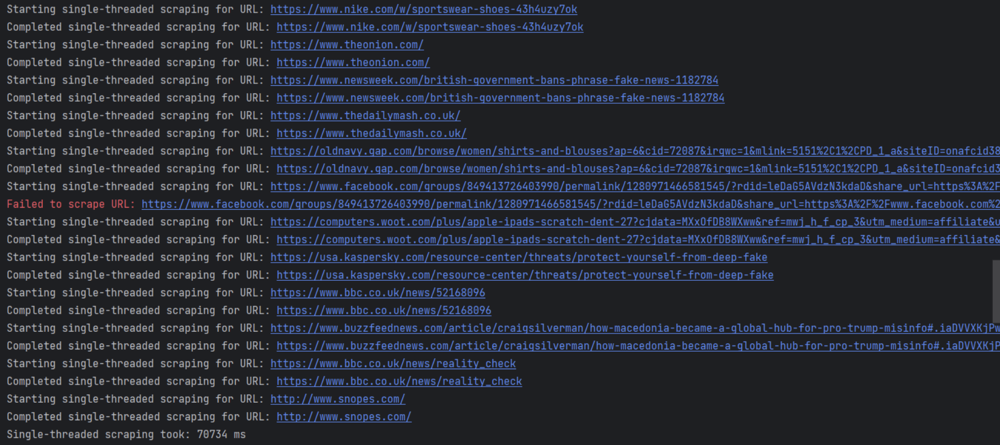
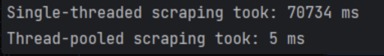
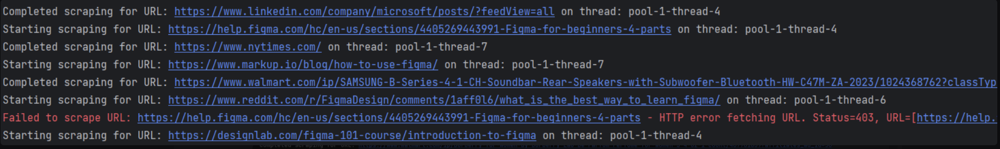
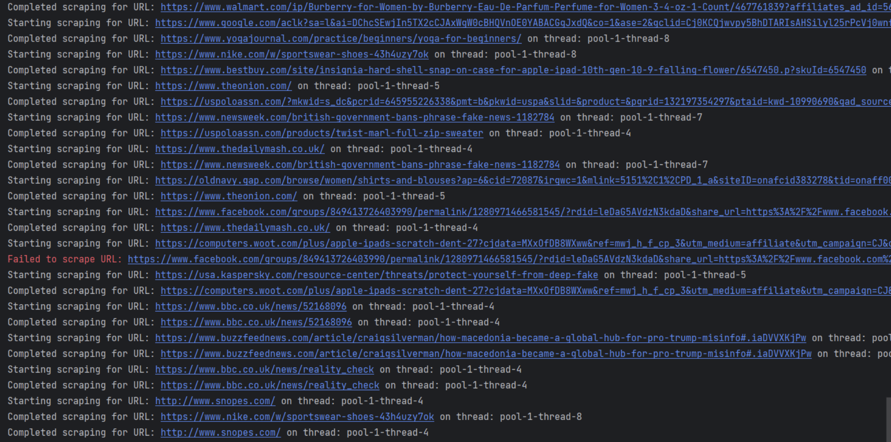

# Assignment 3: Thread Pooling Implementation for Web Content Scraping

## GROUP -4

- **Kush Jayesh Ahir**
- **Swetha Sajjala**
- **Bharathi Pandurangan**

## Project Overview

Our project aims to implement a thread pool to improve the performance of web content scraping and parsing tasks. Specifically, we developed an application to scrape product information from e-commerce websites, such as Amazon, and store the extracted data in a CSV file for potential tabular display and further analysis.

### Project Domain

**Web Content Scraping and Parsing**  
This project involves scraping data from web pages, parsing HTML content to extract specific information (like product details), and storing it in a CSV file. The data in the CSV file can then be utilized for further analysis, visualization, or processing as needed.

## Prerequisites

- **Java 21**
- **Maven** (Compatible with Java 21)

## How to Run the Application

1. Clone the repository and navigate to the project root directory.
2. Run the following command to start the application:
   ```bash
   ./mvnw spring-boot:run
   ```
3. To pass a POST request for scraping, use:

   ```bash
   curl -i -X POST "http://localhost:8080/api/scrape/file"
   ```

## Project Idea

The goal of this project is to create a thread pool to handle performance-critical tasks like scraping and parsing web content. Scraping large volumes of data or multiple pages is time-consuming and resource-intensive. By using a thread pool, we can efficiently manage multiple tasks in parallel, reducing execution time.

## Implementation Details

### Task Selection

Scraping and parsing HTML content to extract product information from e-commerce websites. This data is then stored in a CSV file for easy access and analysis.

### Thread Pool

A thread pool of 10 threads is created to handle scraping tasks. Each thread processes a different URL or data chunk, improving performance by parallelizing tasks. When a thread completes its task, it is reused for subsequent tasks from the queue.

### Performance Measurement

To evaluate the efficiency of thread pooling, we compare the execution times of single-threaded and thread-pooled operations.

- **Single-Threaded Execution:** The application scrapes each URL sequentially, one at a time. This mode simulates a simple, non-parallel scraping process. It gives a baseline time measurement for how long the task would take without concurrency.

  - Example log entry:
    ```
    Starting single-threaded scraping for URL: https://www.example.com
    Completed single-threaded scraping for URL: https://www.example.com
    Single-threaded scraping took: 68736 ms
    ```

- **Thread-Pooled Execution:** A thread pool of 10 threads is used to execute multiple scraping tasks in parallel. Each thread picks up a different URL or data chunk, resulting in faster processing. The total time taken is significantly reduced as each thread handles part of the workload concurrently.
  - Example log entry:
    ```
    Starting scraping for URL: https://www.example.com on thread: pool-1-thread-2
    Completed scraping for URL: https://www.example.com on thread: pool-1-thread-2
    Thread-pooled scraping took: 2 ms
    ```

This comparison demonstrates the performance improvement achieved through multithreading, with a notable reduction in execution time for thread-pooled processing.

#### Example Real-World Usage

- Parallel parsing of HTML elements during web scraping
- Scraping product information from e-commerce sites, useful for data analysis, price comparison, or market research.

### Thread Pool Size

We have configured the pool to contain 10 threads. Each thread is dedicated to a specific element or parsing task, enabling efficient data handling.

## Input and Output Files

### Input File: Contains URLs for scraping, located at:

    ```Assignment3/webscraper/src/main/resources/urls.txt```

### Output File: Contains scraped data, saved as a .csv file at:

    ``` Assignment3/webscraper/scraped_data.csv```

## Output

### Single-threaded Scraping Output (SS1.png):

This output shows the sequential scraping process for multiple URLs, where each URL is handled one at a time.
For each URL, there is a "Starting single-threaded scraping for URL" message followed by a "Completed single-threaded scraping for URL" message.
Some URLs encountered issues, such as the "Failed to scrape URL" message for Facebook, likely due to restricted access or other network errors.
The total time taken for the single-threaded scraping is shown as approximately 70734 ms (70.734 seconds), indicating the slower performance due to sequential processing.



### Thread-pooled Scraping Output (SS2.png, SS3.png, and SS4.png):

These images showcase the parallelized scraping process, where multiple URLs are scraped simultaneously by utilizing a thread pool.
Each thread logs the URL it is scraping, with labels like "on thread: pool-1-thread-X" to indicate the specific thread handling the task.
There is also a "Failed to scrape URL" message for some URLs, such as Figma, with a specific HTTP error code (403), which means access is forbidden, indicating that not all pages could be scraped due to restrictions.
The thread-pooled approach significantly improves performance, with a total time of only 5 ms for the entire scraping operation, demonstrating the efficiency gained from parallel processing.




